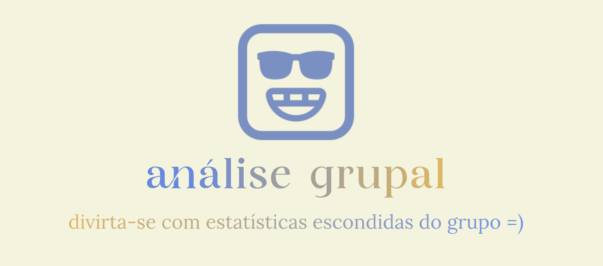

# Análise Grupal 📊📱



Uma plataforma moderna e open-source para analisar dados de bate-papo do WhatsApp. Faça upload do seu chat e mergulhe em métricas e visualizações reveladoras. Entenda melhor seu grupo!

**NENHUM DADO É GUARDADO - ANÁLISES FEITAS EM MEMÓRIA E RETORNADAS DIRETAMENTE PARA O CLIENT**

**Link da API BETA do projeto: https://github.com/fcavalcantirj/analise-grupal-api**

[](https://github.com/fcavalcantirj/analise-grupal-api/blob/main/LICENSE)
[](https://github.com/fcavalcantirj/analise-grupal-api/issues)

## Funcionalidades 🌟

- **Modelagem de Tópicos**: Descubra os principais tópicos discutidos pelo seu grupo.
- **Análise de Sentimento**: Entenda o clima do grupo ao longo do tempo.
- **Mapa de Atividades**: Visualize os horários mais ativos do grupo.
- **Análise de Usuário**: Mergulhe nas estatísticas individuais.
- **Nuvem de Palavras**: Veja as palavras mais usadas.
- ... e muito mais!

## Começando 🚀

### Pré-requisitos

Node.js

### Instalação

1. Clone o repositório
   ```sh
   git clone https://github.com/fcavalcantirj/analise-grupal-api

   ```

2. Rodar o projeto (website) localmente
   ```sh
   npm install
   cd src/
   npm run start

   ```

## Contribuidores

* [fcavalcantirj](https://github.com/fcavalcantirj)

## Suporte

<a href="https://www.buymeacoffee.com/fcavalcantirj" target="_blank"></a>

## Licença

[MIT](https://choosealicense.com/licenses/mit/)

Contato 💌
Felipe Cavalcanti - @fcavalcantirj - contato@analisegrupal.com.br

Link do projeto: https://github.com/fcavalcantirj/analise-grupal-html